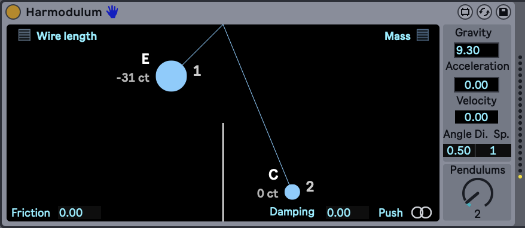

# Harmodulum

<p align="center">
  
</p>

Harmodulum is an interactive harmonic pendulum simulation project implemented in JavaScript for Max/MSP and Ableton Live. It provides a visual and potentially auditory experience of pendulum motion with adjustable physics parameters.

## Features

- Simulate multiple pendulums simultaneously
- Adjust various pendulum properties:
  - Size
  - Arm length
  - Air resistance
  - Velocity
  - Acceleration
  - Damping
- Visual representation of pendulum motion
- Note generation based on pendulum properties
- Physics-based simulation including gravity, angular velocity, and energy calculations

## Files

- `code/harmo_pendulum.js`: Main implementation of the harmonic pendulum simulation

## Setup

1. Clone the repository:
   ```
   git clone https://github.com/ostinsolo/Harmodulum.git
   ```
2. Place the entire Harmodulum folder in your Max for Live devices folder:
   ```
   Documents/Max 9/Max for Live Devices/
   ```
   Note: The device is not freeze-compatible, so all files must be in this location.

## Usage

1. In Ableton Live, load the Harmodulum device onto a MIDI track.
2. Alternatively, open the device in Max/MSP.
3. Click and drag the pendulums to interact with them.
4. Adjust parameters as needed using the device controls.

For detailed information on available functions and parameters, refer to the `harmo_pendulum.js` file.

## Known Issues

Currently, there is one main bug that affects the device's functionality:

When switching views away from the track where the device is placed, the jsui stops rendering. This causes the pendulum to stop sending MIDI and get stuck in place.

To replicate this issue:
1. Start the oscillation
2. Switch to another track
3. Observe that the pendulum stops moving and MIDI output ceases

We are actively investigating this issue. Potential solutions being explored include:
- Moving the entire physics logic into a js object that communicates back and forth with the UI
- Exploring alternative rendering methods, as jsui examples from Max's help section do not exhibit this issue
- Attempting to place the task rendering outside the jsui with a metro (which did not resolve the issue)

If you have any insights or suggestions regarding this bug, please feel free to contribute or reach out.

## Contributing

Contributions to Harmodulum are welcome. Please feel free to submit a Pull Request.

## License

This project is licensed under the Creative Commons Attribution 4.0 International License.

## Contact

For any inquiries or support, please contact:
contact@ostinsolo.co.uk